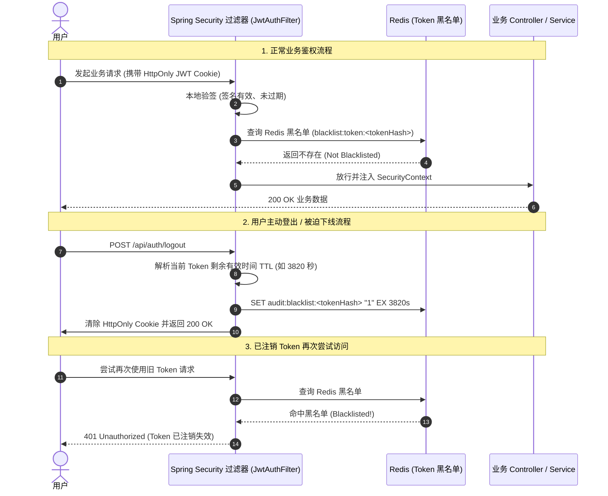

## 1. 经典困境：无状态 JWT 与即时注销的矛盾

在现代分布式微服务与前后端分离架构中，JSON Web Token (JWT) 因其**自包含、无状态、跨服务易解耦**等特性，成为了主流的身份认证标准。

然而，无状态特性是一把双刃剑：
- **优点**：服务端无需保存 Session，网关和各个微服务只需本地使用公钥或共享密钥即可验证身份，具备极高的横向扩展能力；
- **致命缺点**：一旦 JWT 签发，在其生命周期（如 24 小时）结束前，**服务端无法在不重启、不更换密钥的前提下主动作废某个特定 Token**。

如果用户点击了“退出登录”，或者管理员强制下线了某个受感染账号，该用户持有的 JWT 在过期前依然能合法通过鉴权。许多初级项目甚至通过“前端丢弃 Token”来假装完成了注销，这在安全审计中属于严重的高危漏洞。

本文将详细拆解我们在 **AuditVault** 与 **Nexus AI** 双微服务中落地的**“HttpOnly Cookie 传输 + Redis 精确 TTL 黑名单 + Fail-Open 容灾”**的生产级安全鉴权架构。

---

## 2. 传输安全：为什么必须摒弃 localStorage 转用 HttpOnly Cookie？

很多教程习惯将 JWT 存放在浏览器的 `localStorage` 中，并在请求头添加 `Authorization: Bearer <token>`。

```
[ 恶意第三方脚本 / XSS 漏洞 ] ──► 直接读取 window.localStorage.getItem('token') ──► 攻击者窃取 Token
```

- **XSS 攻击风险**：页面只要存在哪怕一处富文本或依赖注入漏洞，恶意脚本就可以肆意读取 `localStorage` 中的敏感 Token 并外发至攻击者服务器；
- **企业级标准方案**：将 JWT 写入 `HttpOnly` + `SameSite=Strict` + `Secure` 的 Cookie 中：
  1. `HttpOnly`：禁止浏览器 JavaScript 脚本读取或篡改 Cookie，从根本上免疫 XSS 窃取；
  2. `SameSite=Strict`：仅在同源或安全导航时附带 Cookie，严格防御跨站请求伪造（CSRF）；
  3. `Path=/`：使两个同域或子域微服务（如 8080 和 8081）能够实现自然的单点登录（SSO）。

```java
ResponseCookie cookie = ResponseCookie.from("token", jwtToken)
    .httpOnly(true)
    .secure(false) // 生产环境配证书后置为 true
    .path("/")
    .maxAge(Duration.ofHours(24))
    .sameSite("Strict")
    .build();
response.addHeader(HttpHeaders.SET_COOKIE, cookie.toString());
```

---

## 3. 架构设计：基于 Redis 黑名单的即时吊销机制

为了在保持 JWT 高性能验签的同时赋予服务端“即时作废”能力，我们引入了**轻量级 Redis 登出黑名单机制**：



### 3.1 内存优化的核心：动态精确 TTL

如果在黑名单中永久存储注销的 Token，随着系统运行，Redis 内存将无限膨胀。

我们的核心设计在于：**黑名单的 Key 过期时间（TTL）精确等于该 JWT 的剩余生命周期**。
- 例如：Token 总有效期 24 小时，用户在登录后第 2 小时点击登出，此时 Token 剩余 22 小时；
- 服务端将该 Token 写入 Redis 黑名单，并设置 TTL 为 22 小时；
- 22 小时之后，即便 Redis 自动将该 Key 删除，由于 JWT 本身自带的 `exp` 声明也已过期，本地校验将直接拒绝，因此不会产生任何安全真空。

### 3.2 核心实现代码

```java
@Service
@Slf4j
public class TokenBlacklistService {

    @Autowired(required = false)
    private StringRedisTemplate redisTemplate;

    private static final String BLACKLIST_PREFIX = "audit:blacklist:token:";

    /**
     * 将登出的 Token 加入黑名单
     * @param token JWT 字符串
     * @param remainingTtlMs 剩余有效期（毫秒）
     */
    public void blacklistToken(String token, long remainingTtlMs) {
        if (redisTemplate == null || token == null || remainingTtlMs <= 0) return;
        try {
            // 对 token 取 SHA-256 摘要或前缀作为 Key，节省 Redis 存储开销
            String key = BLACKLIST_PREFIX + DigestUtils.sha256Hex(token);
            redisTemplate.opsForValue().set(key, "1", remainingTtlMs, TimeUnit.MILLISECONDS);
            log.info("Token successfully blacklisted for remaining {} ms", remainingTtlMs);
        } catch (Exception e) {
            log.error("Failed to add token to Redis blacklist: {}", e.getMessage());
        }
    }

    /**
     * 校验 Token 是否已被注销
     */
    public boolean isBlacklisted(String token) {
        if (redisTemplate == null || token == null) return false;
        try {
            String key = BLACKLIST_PREFIX + DigestUtils.sha256Hex(token);
            Boolean exists = redisTemplate.hasKey(key);
            return Boolean.TRUE.equals(exists);
        } catch (Exception e) {
            // 容灾设计：若 Redis 暂时抖动，打印警告并降级放行（Fail-Open），保障业务可用性
            log.warn("Redis blacklist lookup failed, fallback to valid: {}", e.getMessage());
            return false;
        }
    }
}
```

---

## 4. 防爆破联动：Redis 原子计数器防御暴力破解

在登录接口，系统往往面临撞库和密码爆破攻击。我们结合 Redis 的原子操作设计了 `RedisRateLimiter`：

```java
@Service
@Slf4j
public class RedisRateLimiter {

    @Autowired(required = false)
    private StringRedisTemplate redisTemplate;

    private static final String LIMIT_PREFIX = "audit:ratelimit:ip:";
    private static final int MAX_ATTEMPTS = 5;
    private static final long LOCK_MINUTES = 15;

    public boolean isBlocked(String ip) {
        if (redisTemplate == null || ip == null) return false;
        try {
            String val = redisTemplate.opsForValue().get(LIMIT_PREFIX + ip);
            return val != null && Integer.parseInt(val) >= MAX_ATTEMPTS;
        } catch (Exception e) {
            return false; // Fail-Open
        }
    }

    public void recordFailedAttempt(String ip) {
        if (redisTemplate == null || ip == null) return;
        try {
            String key = LIMIT_PREFIX + ip;
            Long current = redisTemplate.opsForValue().increment(key);
            if (current != null && current == 1) {
                redisTemplate.expire(key, Duration.ofMinutes(LOCK_MINUTES));
            }
        } catch (Exception e) {
            log.warn("Rate limit recording failed: {}", e.getMessage());
        }
    }

    public void clearAttempts(String ip) {
        if (redisTemplate == null || ip == null) return;
        try {
            redisTemplate.delete(LIMIT_PREFIX + ip);
        } catch (Exception e) { /* ignore */ }
    }
}
```

- 同一 IP 连续 5 次登录失败直接触发 15 分钟临时锁定；
- 登录成功立即清除失败计数；
- 全链路支持 Fail-Open，即使缓存中间件短暂抖动也不会影响正常用户的登录流程。

---

## 5. 方案对比与总结

| 鉴权方案 | XSS 安全性 | 即时吊销能力 | 横向扩展性 | 内存开销 |
|---|---|---|---|---|
| **传统 Session 模式** | 中等 | 极佳 | 较差（需 Session 共享） | 高（常驻全量 Session） |
| **纯前端 JWT (localStorage)** | 极差（易被 XSS 盗取） | 无（无法主动失效） | 极佳 | 零服务端内存 |
| **本项目方案 (HttpOnly + Redis 黑名单)** | **极佳 (免疫 XSS)** | **极佳 (毫秒级即时吊销)** | **极佳 (无状态为主+轻量黑名单)** | **极低 (仅存注销 Token，到期自删)** |

该鉴权体系在 AuditVault 与 Nexus AI 的全栈体系中运行稳定，兼顾了高安全防护要求与无状态扩展的高性能需求。
